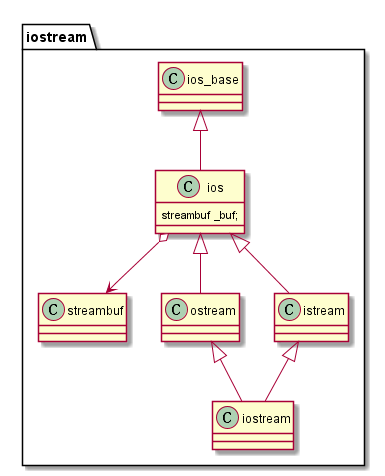

# 输入输出iostream

<div align="center"></div><br>

+ streambuf类为缓冲区提供了内存以及管理缓冲区内存的方法。
+ ios_base类表示流的一般体征，如：是否可读、是二进制流还是文本流等。
+ ios类包含了一个指向streambuf对象的指针成员。
+ ostream类提供了标准输出方法。
+ istream类提供了标准输入方法。
+ iostream继承了标准输入与输出方法。<br>
注1：ostream和istream类分别由模板类由模板类basic_ostream<charT, traits\<charT>>和basic_istream<charT, traits\<charT>>重定义(tyedef)而来。<br>
注2：四种字符类型：char、wchar_t、char16_t、char32_t

### iostream包中的四个对象

+ cin：标准输入流。

+ cout：标志输出流。

+ cerr：标志错误流。

+ clog：标志错误流。

## cout：标志输出
### 1. 成员函数
```c++
ostream & operator<<(type);
ostream & put(char);
ostream & write(const char_type * s, streamsize n);
```

### 2. 使用wirite传输数值数据
```c++
long val = 560031845;
cout.write((const char *)&val, sizeof(long));
```
write可按字节流进行传输。

### 3.刷新输出缓冲区
```c++
cout << flush;
cout << endl;
flush(cout);
```
+ **flush**：刷新缓冲区。
+ **endl**：刷新缓存区，并插入一个换行符。

### 4. 输出格式化
+ 输出数值进制，修改到下一次重设为止：
    - **十六进制**：hex(cout) or cout << hex;
    - **八进制**：cout << oct;
    - **十进制**：cout << dec;
+ 调整字段宽度，只影响下一次输出:
    - cout.width(12);
+ 填充字符，直到更改为止：
    - cout.fill('*');
+ 设置浮点数显示，直到更改为止：
    - cout.precision(2);
+ 打印末尾的0和小数点
    - cout.setf(ios_base::showpoint);
+ **使用头文件iomanip**
    - setprecision()：设置精度。
    - setfill()：填充字符。
    - setw()：字段宽度。

## cin标准输入

### 1. 流状态
+ **eofbit**：文件末尾。
+ **badbit**：流被破坏，如文件读取错误。
+ **failbit**：操作失败，如输入操作未能读取预期的字符。
+ **goodbit**：0
+ **eof()**
+ **bad()**
+ **fail()**
+ **rdstate()**：读取流状态。
+ **exceptions**：返回一个位掩码(bitmark)，指出哪些标记导致异常被引发。
+ **exceptions(iostate ex)**：设置哪些状态将导致clear()引发异常。
+ **clear(iostate s)**：将流状态设置为s。
+ **setstate(iostate s)**：调用clear(rdstate()|s)。

### 2. istream类方法


## 文件输入输出

>ofstream类和ifstream类。

## 内核格式化
  
